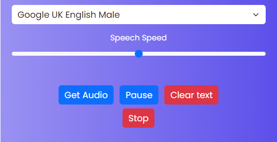

# Text-to-Speech Web Application

A simple and modern web application that converts text input into speech using the browser's built-in speech synthesis capabilities. The project features a clean user interface and is easy to use for anyone looking to quickly convert written text to audio.

## Features

- Convert any text to speech directly in your browser
- Intuitive and responsive user interface
- Customizable voice options (based on browser support)
- No backend required; works entirely client-side
- Lightweight and fast

## Technologies Used

- HTML5
- CSS3
- JavaScript (Vanilla)
- [Web Speech API](https://developer.mozilla.org/en-US/docs/Web/API/Web_Speech_API) (SpeechSynthesis)

## Getting Started

1. **Clone the repository:**
   ```sh
   git clone https://github.com/JanishkaM/text-to-speech.git
   ```
2. **Open `index.html` in your browser.**
   - No installation or build steps required.

## Usage

1. Enter your text in the input field.
2. Select your preferred voice and adjust settings if available.
3. Click the "Speak" button to hear your text read aloud.

## Project Structure

```
text-to-speech/
├── index.html
├── comment.html
└── assets/
    ├── app.js
    ├── style.css
    └── img/
        ├── icon.png
        ├── Interface.png
        ├── logo.png
        └── logobg.png
```

- `index.html`: Main application page
- `comment.html`: Additional information or comments
- `assets/app.js`: JavaScript logic for text-to-speech
- `assets/style.css`: Stylesheet for UI
- `assets/img/`: Images and icons used in the app

## Screenshots



## License

This project is licensed under the MIT License.

## Author

- [JanishkaM](https://github.com/JanishkaM)
